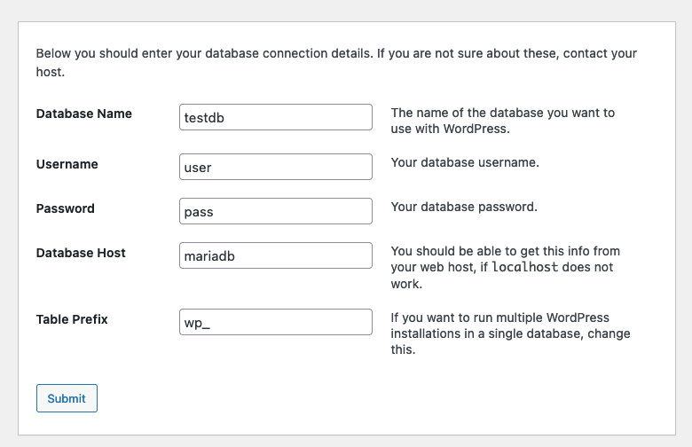

# How to start

```bash
docker compose -p xampp up --build
```

Use CTRL-C to stop the containers.

# What you can do

## connect the DB via CLI

```bash
docker exec -it -e MYSQL_PWD=rootpass xampp-mariadb-1 mysql -u root testdb
```

in this project the folder db-mount is mounted into the container as /mnt/sql.

You can execute the sql files in db-mount via

```bash
source /mnt/sql/test-table.sql;
source /mnt/sql/test-insert.sql;
```

## phpmyadmin

open http://localhost:8088/

* user: test
* password: pass

## test the web server (apache)

open http://localhost:8080/ - should show the php info page

## Playfield: use the web server for Wordpress

* download https://wordpress.org/download/
* unzip and place the folder `wordpress` into www-root
* go to http://localhost:8080/wordpress and follow the install wizard

Use these DB connection parameters:
 
