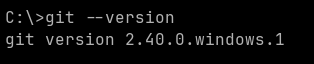
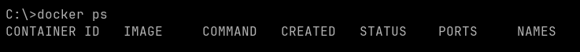
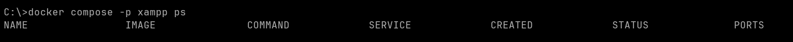

# Philosophy

We believe: 

* Command line tools are better than UI tools

* Local installations should be avoided and only bootstrapping tools are ok

* Each chapter should teach something practical while theoretical background is optional but available

# Preparation

You should have a terminal of your choice:

* [cmd.exe](https://learn.microsoft.com/en-us/windows-server/administration/windows-commands/cmd) (good enough default for best beginners)
* [Powershell](i) (for people interested in this Windows only technology)
* [Windows Terminal](https://apps.microsoft.com/store/detail/windows-terminal/9N0DX20HK701) (offers cmd.exe and powershell with tabs)
* [WezTerminal](https://wezfurlong.org/wezterm/index.html) (cross platform terminal)

You should also have an editor of your choice:

* [VS Code](https://code.visualstudio.com/) (best default for beginners)
* [Neovim](https://neovim.io/) (for advanced users only)

Install

* Docker Desktop - [Windows docker](https://docs.docker.com/desktop/install/windows-install/)
* git - [Windows git](https://git-scm.com/download/win)

# Check the tools

## git

Open your terminal and type:

```
git --version
```

this should print something like:



## docker

Type:

```
docker ps
```

expected result:



```
docker compose -p xampp ps
```



# Clone (download) git repository

Having spaces in your path is never a good idea, so let's create a base folder on the root of C:

Type:

```
cd \
mkdir dev
cd dev
git clone https://github.com/oglimmer/xampp
cd xampp
```

# Summary

You have cloned this project to your local filesystem and all locally installed tools are available.

[Click here to proceed](../ch02/readme.md)
