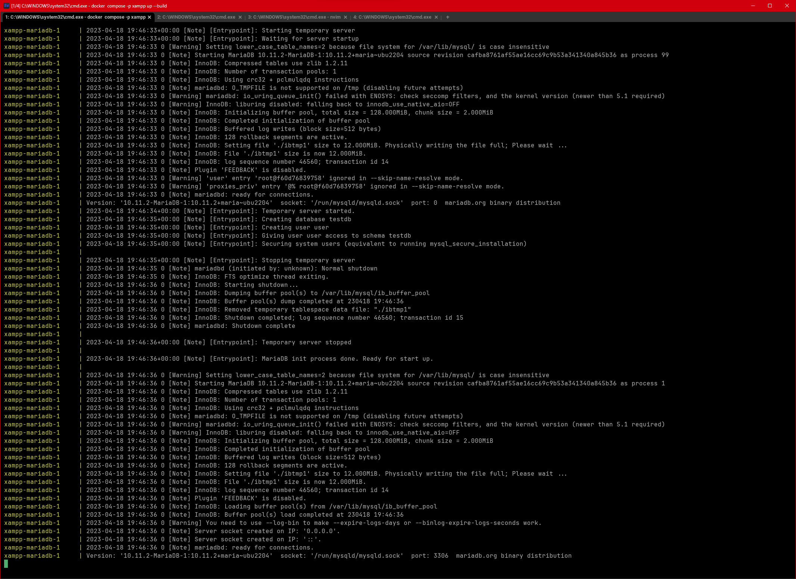

# Starting infrastructure (the database and webserver)

Assuming you have your terminal application open and your current directory is `C:\dev\xampp`

Type:

```
docker compose -p xampp up --build
```

This should output


